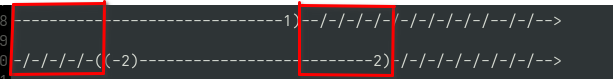
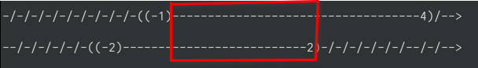

# Math: Hợp và Giao

**mục lục**

- 1.Hợp

- 2.Giao

- 3.Hiệu của hai tập hợp, phần bù của tập con 

- 4.Các ký hiệu ở các tập ( ) và [ ]

---

## 1.Hợp

- Tập hợp các phần tử thuộc tập hợp A hoặc thuộc B ký hiệu là $$\large A\cup B$$. Ví dụ khi ta có $$(\large-\infty;1)\cup(-2;2)$$ trước tiên phải vẽ cái đã :

------------------------------1)--/-/-/-/-/-/-/-/-/-/--/-/-->

-/-/-/-/-((-2)--------------------------2)-/-/-/-/-/-/-/-/-->

Ta thấy 2 và $$\large-\infty$$ đều thụt ra ngoài range trùng khớp với -2 tới -1 ở hai đường vẽ, bây giờ kết quả là $$\large(-\infty;2)$$

## 2.Giao

- Tập hợp các phần tử thuộc tập hợp A và thuộc B ký hiệu là $$\large A\cap B$$. Ví dụ khi ta có $$\large(-1;4)\cap(-3;2)$$ trước tiên phải vẽ:

-/-/-/-/-/-/-/-/-/-((-1)-----------------------------------4)/-->

--/-/-/-/-/-((-2)--------------------------2)-/-/-/-/-/-/--/-/-->

Ta thấy -1 và 2 là range có trùng khớp với cả hai hình vẽ nên nó sẽ là (-1;2)

## 3.Hiệu của hai tập hợp , phần bù

- Hiệu cua hai tập hợp : Cho cả hai tập hợp, nếu các phần tử thuộc A nhưng ko thuộc B gọi là hiệu của A và B, ký hiệu `A \ B` : 

$$\large
A \ B = {x | x \in A, x \notin B}
$$

- Phần bù : nếu A là tập con của U thì hiệu `U \ A` gọi là phần bù của A trong U, ký hiệu $$\large C_{U}A$$

ví dụ vơi hiệu của hai tập hợp $$\large(-\infty;\sqrt{2}] \ [-1;+\infty)$$ bây giờ ta tiến hành vẽ :

-----------------------------------(1.4142)]-/-/-/-/-/-/-/-/-/->

--/-/-/-/-/-/-/-/-/-/-/-/-/-/-/-(-1)[----------------------------->

ta thấy vùng bên ngoài ở range là từ $$\large-\infty$$ đến `-1` đó là kết quả vậy : $$\large(-\infty;-1)$$

Còn ví dụ với phần bù, ta có : $$\large C_{\mathbb{R}}(-\infty;2)$$, ta có kết quả như sau : $$\large C_{\mathbb{R}}(-\infty;2) = [2;+\infty)$$. Vì sao lại như thế, vì âm vô hạn đã chưa tất cả số nhỏ hơn 2 kể cả số thực dương, khi lấy phần bù trong $$\large\mathbb{R}$$ ta chỉ lấy những số ko thuộc khoảng này những số ko thuộc là số 2 và lớn hơn 2. Vì sao lại là dấu `[`, vì dấu `[` là nhỏ hơn hoặc bằng, nên kết quả thành `[2.. = 2<=..`

## 4.Các ký hiệu ở các tập ( ) và [ ]

ký hiệu `[ ]` thuộc dạng nhỏ hơn hoặc bằng ví dụ `[a; b) = a <= x < b`, `[a; b] = a <= x <= b`

ký hiệu `( )` thuộc dạng nhỏ hơn nhưng ko bằng ví dụ `(a ; b) = a < x < b`